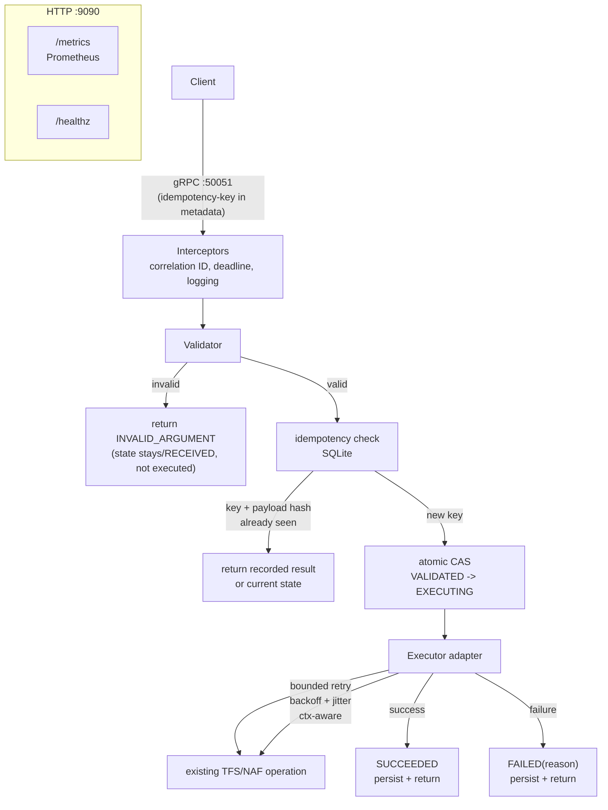

# Architecture

## Diagram

Ports:

- `:50051` — gRPC service + `grpc.health.v1.Health` (same server)
- `:9090` — plain HTTP: `/metrics` (Prometheus) and `/healthz`

## Component responsibilities

| Component       | Responsibility | Must NOT do                     |
| --------------- | -------------- | ------------------------------- |
| Interceptors    | Correlation ID creation/propagation, request logging, metrics | Business logic |
| Validator       | Structural validation of the request | Call TFS/NAF |
| Idempotency     | Key scoping, payload-hash comparison, duplicate detection | Execute anything |
| Store (SQLite)  | Durable operation records, atomic state CAS | Decide policy |
| Executor        | Adapt to the real TFS/NAF op; the ONLY component that talks to the platform | Store state, classify errors |
| Retry policy    | Classify errors, bound attempts, backoff | Retry non-retryable errors |

## The four design decisions (read before building)

### D1 — The state machine is persisted, not in-memory

Every state transition is a row write with a timestamp. After a crash, any
record found in `EXECUTING` is **in-doubt**: the gateway cannot know whether the
downstream operation completed. You must decide, and document:

- Re-execute only if the downstream operation is itself idempotent, or
- Mark `FAILED` with reason `in_doubt` and surface for reconciliation.

There is no universally correct answer — the answer must match the semantics of
the wrapped TFS/NAF operation. This is the at-most-once vs at-least-once tradeoff.

### D2 — Idempotency scope

Idempotency key = `idempotency-key` metadata + operation name + SHA-256 of the
deterministic proto marshal of the payload.

- Same key, same payload, already completed → return the recorded result. Never execute again.
- Same key, same payload, in flight → wait for completion (or return current state).
- Same key, **different payload** → reject. Never silently execute.

The `VALIDATED -> EXECUTING` step must be atomic: a SQL
`UPDATE ... WHERE id = ? AND state = 'VALIDATED'` checked via `RowsAffected == 1`
is the durable fence. A per-key in-process mutex reduces contention; the SQL CAS
is the correctness guarantee.

### D3 — Retry classification

Retry only failures that (a) are explicitly retryable AND (b) provably occurred
before any side effect. The subtle case: a deadline or connection drop *after*
execution started is ambiguous — do not blind-retry a side-effecting operation;
fail it as in-doubt (see D1). Backoff is exponential with jitter, bounded by the
parent deadline: check `ctx.Done()` before every attempt.

### D4 — Deadline propagation

The request context flows from the gRPC handler into the store writes, the
executor call, and every retry wait. Never create a fresh `context.Background()`
inside the request path. When the deadline fires, return `DEADLINE_EXCEEDED`
promptly — no retry storm.

## Failure modes to design for (tested on Wednesday/Friday)

| Failure                  | Expected behavior                                  |
| ------------------------ | -------------------------------------------------- |
| Duplicate concurrent req | Exactly one execution                              |
| Duplicate after success  | Recorded result returned, zero executions          |
| Key reuse, new payload   | Rejected with distinct error                       |
| Retryable failure x2     | Third attempt succeeds, all recorded               |
| Non-retryable failure    | Single attempt, FAILED                             |
| Client cancels mid-flight| Work stops, state consistent                       |
| Deadline mid-execution   | DEADLINE_EXCEEDED, in-doubt handling               |
| kill -9 during EXECUTING | Restart: state recovered, correct resume/fail path |
| Malformed request        | INVALID_ARGUMENT, no state beyond RECEIVED        |
